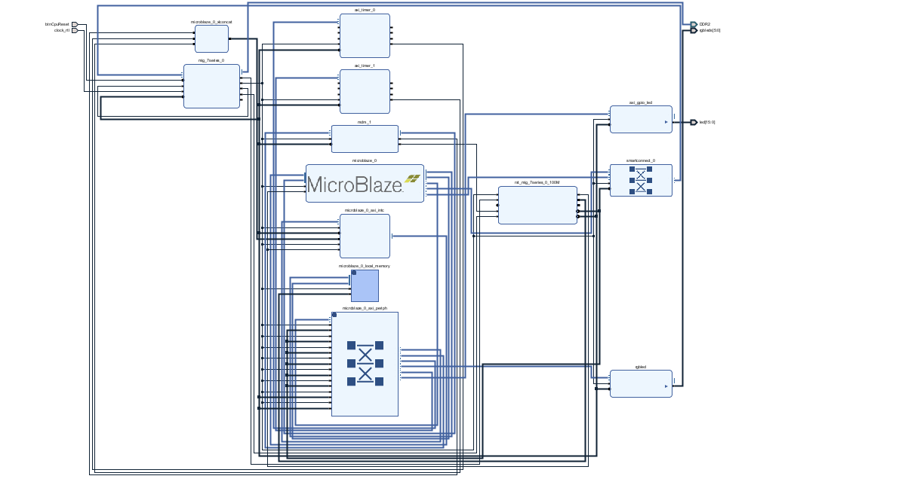

# MicroBlaze_Timing_and_Performance_Analysis

This project is a timing and performance measurement application developed for an embedded systems laboratory environment using a Xilinx MicroBlaze based platform. The goal of the project is to measure and analyze the number of processor clock cycles required to execute specific operations under different system conditions.

## System Architecture

The block design below shows the overall MicroBlaze based system architecture used for the experiments.

