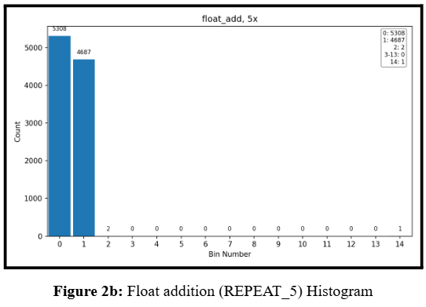
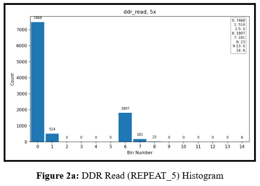
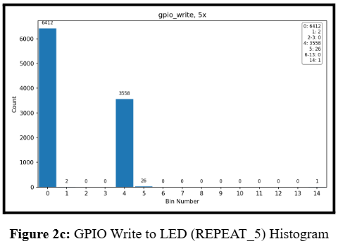

# MicroBlaze_Timing_and_Performance_Analysis

This project is a timing and performance measurement application developed for an embedded systems laboratory environment using a Xilinx MicroBlaze based platform. The goal of the project is to measure and analyze the number of processor clock cycles required to execute specific operations under different system conditions.

## System Architecture

The block design below shows the overall MicroBlaze based system architecture used for the experiments.

## Application Level Description

At the application level, this project measures the number of processor clock cycles required to execute different types of operations. A hardware timer is sampled before and after a selected operation to compute execution time. This process is repeated across a large number of trials to capture timing variability.

The application supports timing analysis for multiple operation types, including:
- Floating point arithmetic operations
- DDR memory read operations
- GPIO LED write operations
- Console output using formatted printing functions

## Performance Results and Histograms

The execution time results were processed and visualized using histograms to show the distribution of clock cycles for each operation type.

Floating Point Addition Histogram

This histogram shows the execution time distribution for repeated floating point addition operations.

DDR Memory Read Histogram

This histogram illustrates the timing behavior of DDR memory read operations and highlights memory access latency and cache effects.

GPIO LED Write Histogram

This histogram represents the execution time required to write data to the LED GPIO peripheral.

