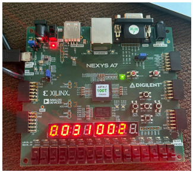
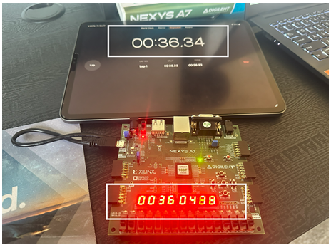
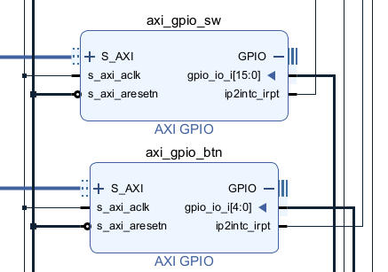
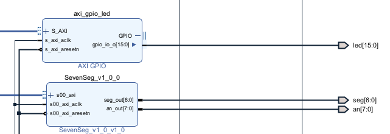

# MicroBlaze_Stopwatch_7Segment_Controller

This project implements a MicroBlaze based stopwatch that displays time on an 8 digit seven segment display and is controlled using five push buttons. A hardware timer interrupt generates a precise 1 ms tick, enabling accurate real time counting with start, stop, direction control, and reset functionality. It provides a practical example of real time embedded system design using FPGA based SoC architecture.

## Application Level Description

At the application level, the stopwatch maintains millisecond and second counters that are updated inside a timer interrupt service routine. The timer generates a periodic interrupt every 1 millisecond, allowing the system to track time accurately and independently of display refresh or button polling.

The main execution loop continuously multiplexes the seven segment display by cycling through all eight digits and rendering the corresponding values. Button inputs are read through an AXI GPIO interface, and edge detection logic ensures that each button press triggers a single action.

The stopwatch supports both count up and count down modes. In count down mode, the time value is clamped at zero to prevent underflow.

### Button Controls

- **Right**: Start stopwatch and count up  
- **Left**: Stop stopwatch  
- **Up**: Set count up direction  
- **Down**: Set count down direction  
- **Center**: Reset time to 00:00.000

### Timer Counting Behavior

### Timer Verification

The stopwatch timing was verified against an external reference to confirm correct operation and accuracy.

## System Architecture

The stopwatch system is built around a MicroBlaze soft processor connected to an AXI Timer, AXI GPIO for button input, a seven segment display interface, and an interrupt controller. The timer interrupt drives the timekeeping logic, while the processor handles display updates and user input.

### RTL Block Design Inputs

### RTL Block Design Outputs

