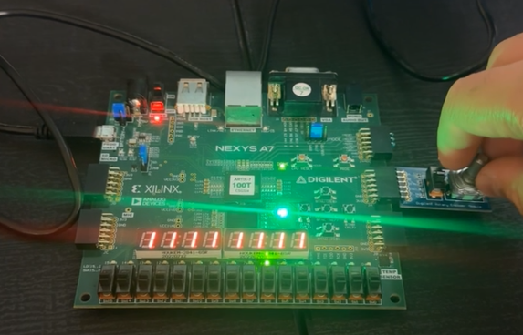
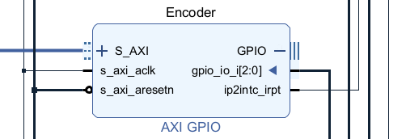
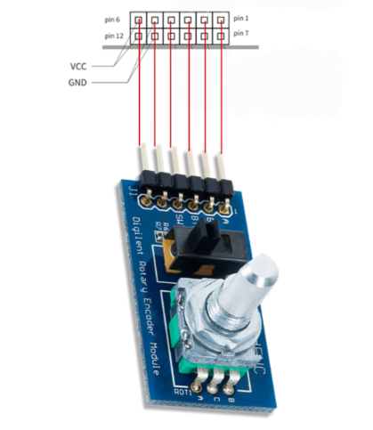

# MicroBlaze_Rotary_Encoder_LED_Controller

This project implements a rotary encoder controlled LED cursor using a MicroBlaze based FPGA system. The encoder rotation moves a single active LED left or right, while a push button toggles the display on and off, demonstrating interrupt driven input handling and real time I O control.

## Application Level Description

At the application level, the system uses a rotary encoder to control the position of a single active LED across a bank of sixteen LEDs. Clockwise rotation increments the LED position, while counter clockwise rotation decrements it. The current LED position is maintained in software and updated in response to encoder interrupts.

A push button integrated with the rotary encoder allows the user to enable or disable the LED display. Button presses are debounced in software using a hardware timer running in free running mode. When the display is disabled, all LEDs are turned off and encoder rotation events are ignored.

An RGB LED provides visual feedback for certain system states, and a seven segment display is multiplexed to indicate whether the system is enabled or disabled.

## Encoder Operation

The rotary encoder is decoded using a finite state machine that tracks the A and B phase signals. Encoder transitions are processed inside an interrupt service routine, which sets flags for clockwise or counter clockwise rotation. These flags are handled in the main loop to update the LED position safely outside the interrupt context.

Push button presses are detected using edge detection and validated using a time based debounce window measured in microseconds.

## System Architecture

The system is built around a MicroBlaze soft processor connected to several AXI peripherals, including GPIO cores, a hardware timer, and an interrupt controller.

### AXI GPIO Decoder Block Design

## Encoder Wiring

The rotary encoder is connected to the FPGA through the JA header.

