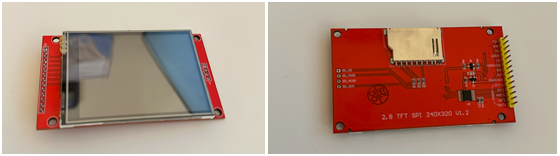

# LCD Volume UI with QP-nano HSM on MicroBlaze

**Authors:** Saif Alomari, Dominic Zboyan

This project implements an interactive LCD volume control UI on a Nexys A7 FPGA board running on a MicroBlaze softcore processor. The firmware is structured around a QP-nano Hierarchical State Machine (HSM) that manages UI state transitions driven by a rotary encoder and push-button inputs. The display renders a tiled triangle background pattern on a 2.8 inch SPI TFT LCD, with a volume bar and message box overlay that appear on user interaction and auto-dismiss after 2 seconds of inactivity.

## Application Level Description

At the application level, the system uses a rotary encoder to control a volume level displayed as an overlay bar on the LCD. Rotating the encoder clockwise increases the volume while counter-clockwise decrements it. Pressing the encoder button toggles mute. A dedicated push button displays a message box overlay on screen. All UI overlays are drawn on top of a persistent tiled triangle background and cleared automatically after a period of inactivity.

The overlay removal is optimized to avoid full-screen redraws. Rather than clearing the entire display, only the tiles that spatially overlap the volume bar or message box regions are redrawn individually, restoring the background pattern efficiently.

## Background Pattern

The background is rendered as a tiled pattern of isosceles triangles across the full 240x320 display using 40x40 pixel tiles. A draw triangle function determines the left and right boundary of the triangle at each scanline and fills pixels accordingly using foreground and background colors. The full background is rendered by iterating over all tiles and calling this function for each one.


## Hardware Setup

The system uses a 2.8 inch TFT SPI LCD at 240x320 resolution connected to the Nexys A7 through the Pmod header. The rotary encoder connects through a separate GPIO-mapped Pmod header, with the A and B phase signals and the push button switch all mapped as GPIO inputs in the Vivado block design.



## FSM Architecture

The application uses QP-nano, a lightweight event-driven framework for deeply embedded systems. A single active object owns a 30-event queue and runs an HSM across the following states.

The FSM starts in the Initial state and immediately transitions to the ON state, which initializes the LCD and enters UI_IDLE. In UI_IDLE, encoder and button events are handled but no timer is running. Any user input transitions the FSM into UI_ACTIVE, which starts a 2-second peripheral timer on entry. If another event occurs while in UI_ACTIVE, the timer is restarted. When the timer expires without any new input, the TIMER_END signal is dispatched, the overlay is cleared, and the FSM returns to UI_IDLE.

```
Initial
└── ON  (Q_ENTRY_SIG: startScreen())
    ├── UI_IDLE
    │     ENCODER_UP    → increase_volume()
    │     ENCODER_DOWN  → decrease_volume()
    │     ENCODER_CLICK → toggle_mute()
    │     BUTTON_PRESS  → printButtonMessage()
    │     [any event]   → Q_TRAN(UI_ACTIVE)
    │
    └── UI_ACTIVE  (ENTRY: startTimer())
          ENCODER_UP    → increase_volume()
          ENCODER_DOWN  → decrease_volume()
          ENCODER_CLICK → toggle_mute()
          BUTTON_PRESS  → printButtonMessage()
          [any event]   → restart timer
          TIMER_END     → clearUI() → Q_TRAN(UI_IDLE)
```

## System Architecture

The system is built around a MicroBlaze soft processor connected to several AXI peripherals, including an SPI controller for the LCD, GPIO cores for the rotary encoder and buttons, a hardware timer for the inactivity timeout, and a UART for serial debug output via xil_printf.

