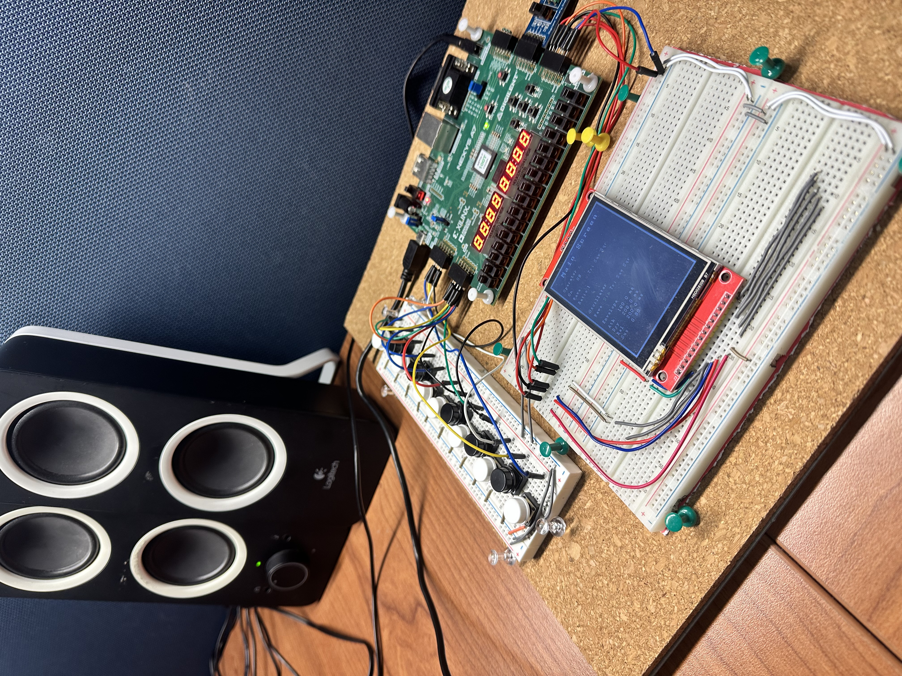
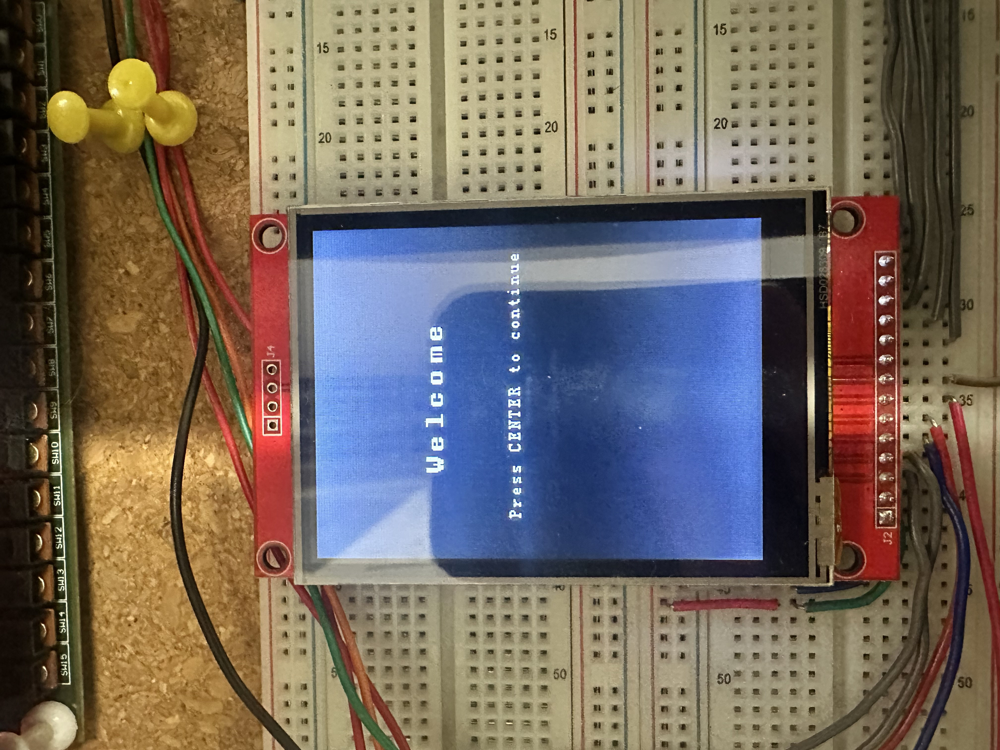
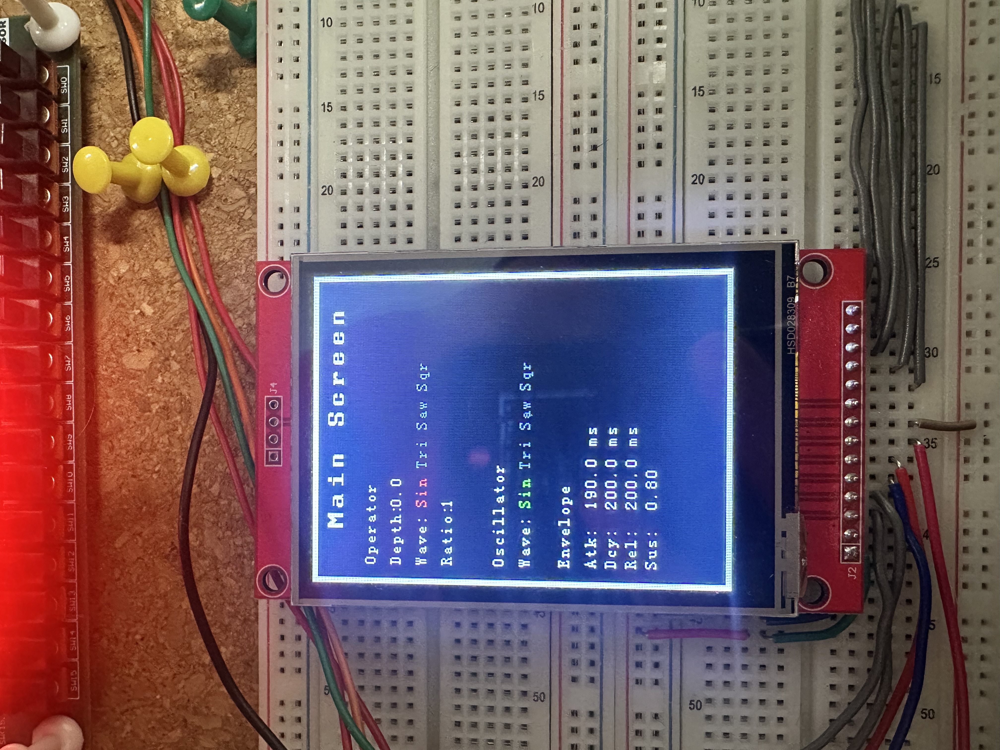
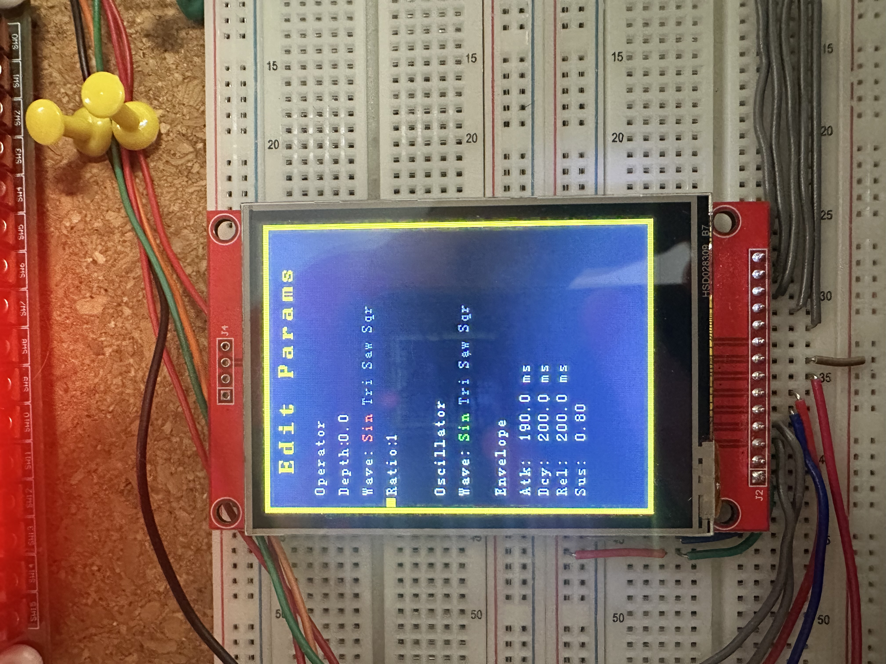

# MicroBlaze_FM_Synthesizer



This project implements a polyphonic FM synthesizer on a Nexys A7 FPGA board running on a MicroBlaze softcore processor. A 14-key piano keyboard mapped to GPIO drives real-time note playback through a software FM synthesis engine with a full ADSR envelope. Synthesis parameters are displayed and edited live on a 2.8 inch SPI TFT LCD using a QP-nano Hierarchical State Machine to manage UI state. The system supports up to two octave shifts and multiple waveform types for both the carrier oscillator and the FM operator.

## Application Level Description

At the application level, the system presents two primary screens managed by the HSM: a main parameter view for live playback and an edit screen for adjusting synthesis parameters. On startup a welcome screen is shown, and pressing the center button enters the main screen where the current synthesis parameters are displayed and the piano keyboard is active.

Pressing keys triggers polyphonic note-on events, with each key assigned to a voice from the voice pool. Releasing a key triggers note-off on the corresponding voice, which then enters the release phase of the ADSR envelope. Two dedicated keys handle octave up and octave down shifts, extending the playable range across five octaves. Toggling SW0 switches between the main play screen and the edit screen without interrupting active voices, which are silenced cleanly on exit.

## FM Synthesis Engine

The synthesis engine implements two-operator FM synthesis, where a modulator operator modulates the phase of a carrier oscillator at audio rate. The operator is configured with a frequency ratio relative to the carrier and a modulation depth that scales the intensity of the frequency modulation. Both the operator and the carrier support four selectable waveforms: sine, triangle, sawtooth, and square.

Each voice maintains an independent ADSR envelope applied to its output amplitude. The attack, decay, and release stages are parameterized in milliseconds and converted to sample counts at initialization. The sustain level is a normalized float between 0 and 1. All eight synthesis parameters are exposed through the edit screen and take effect immediately when SW0 is toggled back to the main screen.

## FSM Architecture

The application uses QP-nano to structure the firmware as a Hierarchical State Machine. A single active object owns a 30-event queue and runs across the following states.

The FSM starts in the Initial pseudo-state, which resets all synthesis parameters to their defaults and clears the key-to-voice map before transitioning to the Welcome state. The Welcome state renders an intro screen and waits for a center button press to transition to the Main state. The Main state activates the piano keyboard, renders the current parameter values, and applies them to the audio engine. Toggling SW0 on transitions to the Edit state. The Edit state renders a parameter list with a blinking selection cursor driven by a periodic TIME_TICK event. The up and down buttons navigate the cursor between parameters, and the left and right buttons adjust the selected parameter value in real time. Toggling SW0 off commits the edited parameters to the audio engine and returns to the Main state. Pressing the encoder click button in either the Main or Edit state resets all parameters to defaults.

```
Initial
└── ON
    ├── Welcome
    │     BTN_CENTER → Q_TRAN(Main)
    │
    ├── Main  (ENTRY: drawMainStaticLayout, apply audio params, enable keys)
    │     ENCODER_CLICK → reset defaults, redraw
    │     SW0_ON        → Q_TRAN(Edit)
    │     Q_EXIT        → stop all voices
    │
    └── Edit  (ENTRY: drawEditStaticLayout, start blink cursor)
          TIME_TICK      → toggle cursor blink
          BTN_UP         → select previous parameter
          BTN_DOWN       → select next parameter
          BTN_LEFT       → decrement selected parameter
          BTN_RIGHT      → increment selected parameter
          ENCODER_CLICK  → reset defaults, redraw
          SW0_OFF        → apply audio params → Q_TRAN(Main)
```

## LCD Screens

On startup the welcome screen is displayed, prompting the user to press the center button to begin. The main screen displays all current synthesis parameters in a read-only view during live playback. The edit screen renders the same parameter list with a blinking yellow selection cursor indicating which parameter is active for adjustment.

Welcome Screen



Main Screen



Edit Screen



## Hardware Setup

The system uses a 2.8 inch TFT SPI LCD at 240x320 resolution connected to the Nexys A7 through a Pmod SPI interface. The 14-key piano keyboard is wired to a dedicated AXI GPIO core configured as an input-only channel. Keys 0 through 11 map to the chromatic notes C through B, key 12 shifts the octave up, and key 13 shifts the octave down. A debounce window of 50 timer ticks, corresponding to approximately 1 millisecond at a 20 microsecond tick period, is applied per key to suppress contact bounce. The five push buttons on the Nexys A7 are mapped through a separate GPIO core and generate BTN events consumed by the HSM.

## GPIO and Interrupt Architecture

Key press and release events are handled entirely in an interrupt service routine attached to the AXI GPIO core. On each interrupt, the ISR reads the raw GPIO state, computes which keys changed relative to the last stable state, applies the per-key debounce filter using the system tick counter, and dispatches note-on or note-off directly to the audio engine. This keeps key latency deterministic and independent of the main loop or HSM dispatch cycle.

A second AXI timer runs in PWM mode and drives the audio output. A third timer generates a periodic interrupt at the sample rate, which increments the system tick counter and sets the resample flag consumed by the audio processing loop.

## System Architecture

The system is built around a MicroBlaze soft processor connected to several AXI peripherals including an SPI controller for the LCD, two AXI GPIO cores for the piano keys and push buttons, two AXI timers for PWM audio output and sample rate interrupts, an interrupt controller, and a UART for serial debug output via xil_printf.

## Build and Flash

This project is built using the Xilinx Vitis IDE targeting a MicroBlaze softcore instantiated in Vivado. After generating the bitstream and exporting the hardware platform, a Vitis application project is created by importing the source files and linking the QP-nano sources. The project is then built and flashed to the board over JTAG. Serial debug output is available at 115200 baud.
