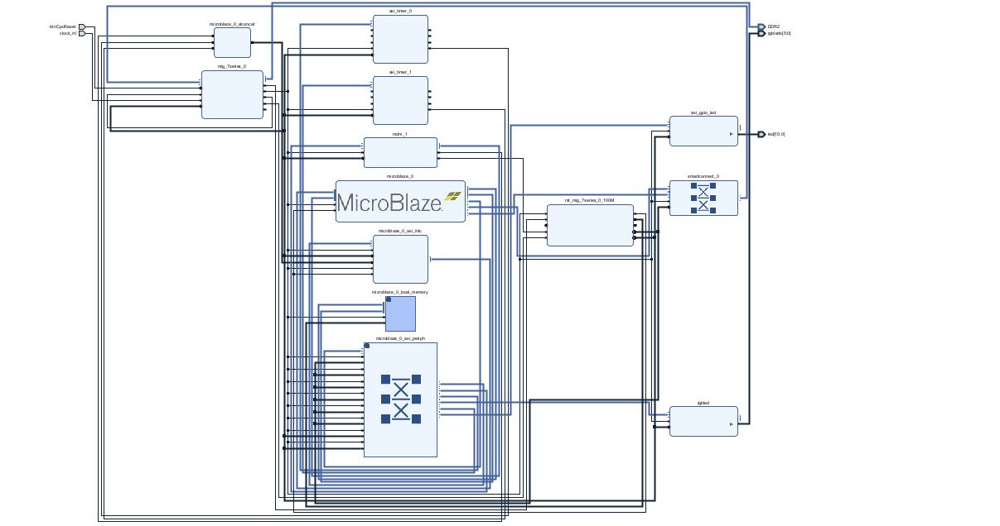
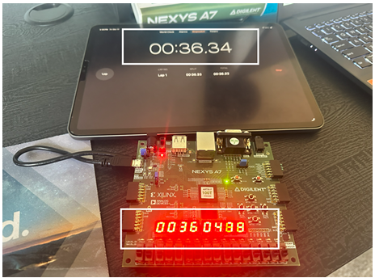
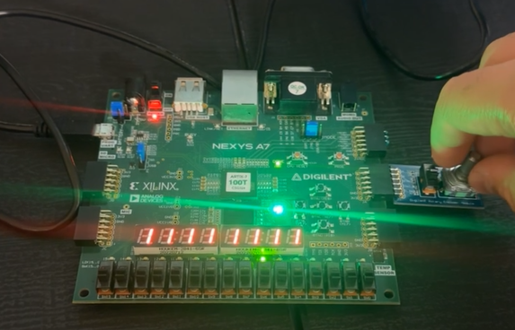
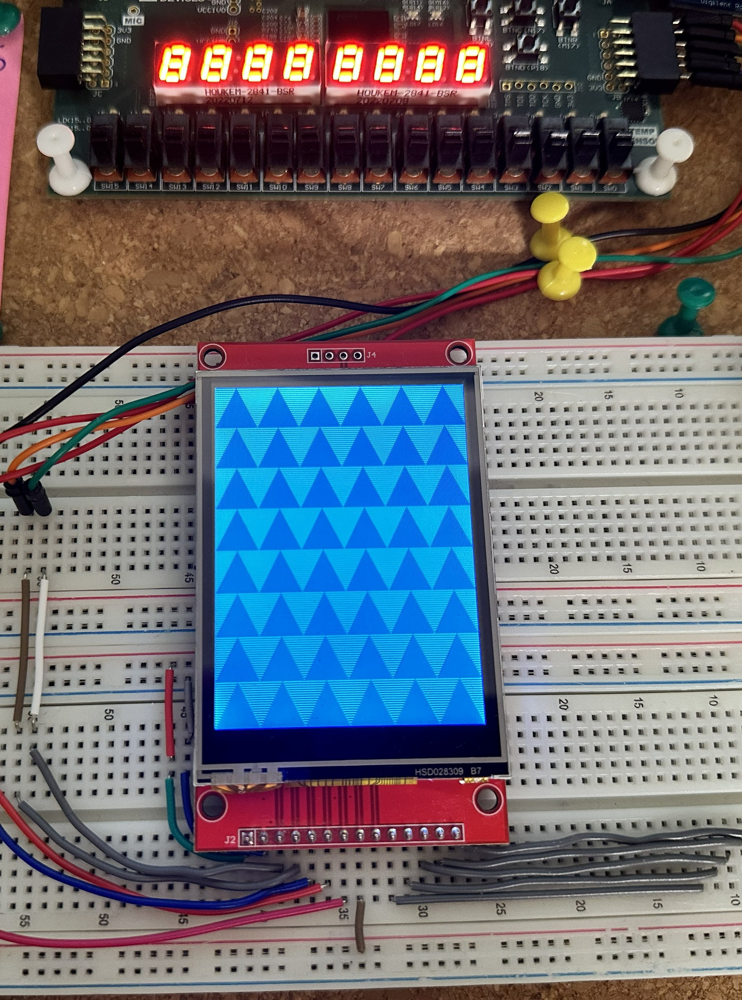

# UCSB_Embedded_Computing_Systems_Fall2025

**Authors:** Saif Alomari, Dominic Zboyan

System synthesis and modeling techniques including partitioning, scheduling, control and data flow analysis and functional representation.

**Project_01:** This project analyzes execution time and clock cycle behavior on a MicroBlaze based FPGA system using hardware timer measurements.

**Project_02:** This project implements a stopwatch on a MicroBlaze based FPGA system using a hardware timer interrupt, push button controls, and an eight digit seven segment display.

**Project_03:** This project implements a rotary encoder controlled LED system on a MicroBlaze based FPGA platform using interrupt driven input handling and real time GPIO control.

**Project_04:** This project implements an interactive LCD volume control UI on a Nexys A7 FPGA board running on a MicroBlaze softcore processor.

**Project_05:** This project implements a polyphonic FM synthesizer on a Nexys A7 FPGA board running on a MicroBlaze softcore processor. A 14-key piano keyboard mapped to GPIO drives real-time note playback through a software FM synthesis engine with a full ADSR envelope. Synthesis parameters are displayed and edited live on a 2.8 inch SPI TFT LCD using a QP-nano Hierarchical State Machine to manage UI state. The system supports up to two octave shifts and multiple waveform types for both the carrier oscillator and the FM operator.

## Project Gallery

<table>
  <tr>
    <td align="center"><b>Project 01</b></td>
    <td align="center"><b>Project 02</b></td>
    <td align="center"><b>Project 03</b></td>
  </tr>
  <tr>
    <td align="center"></td>
    <td align="center"></td>
    <td align="center"></td>
  </tr>
  <tr>
    <td align="center"><b>Project 04</b></td>
    <td align="center"><b>Project 05</b></td>
    <td>align="center"><b>Project 05</b></td>
  </tr>
  <tr>
    <td align="center"></td>
    <td align="center">
      
    </td>
    <td></td>
  </tr>
</table>
